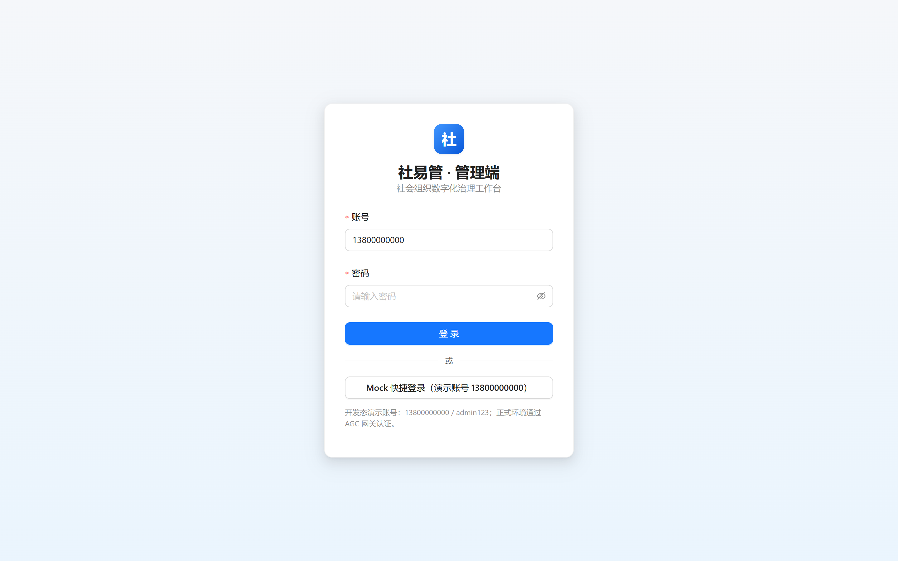
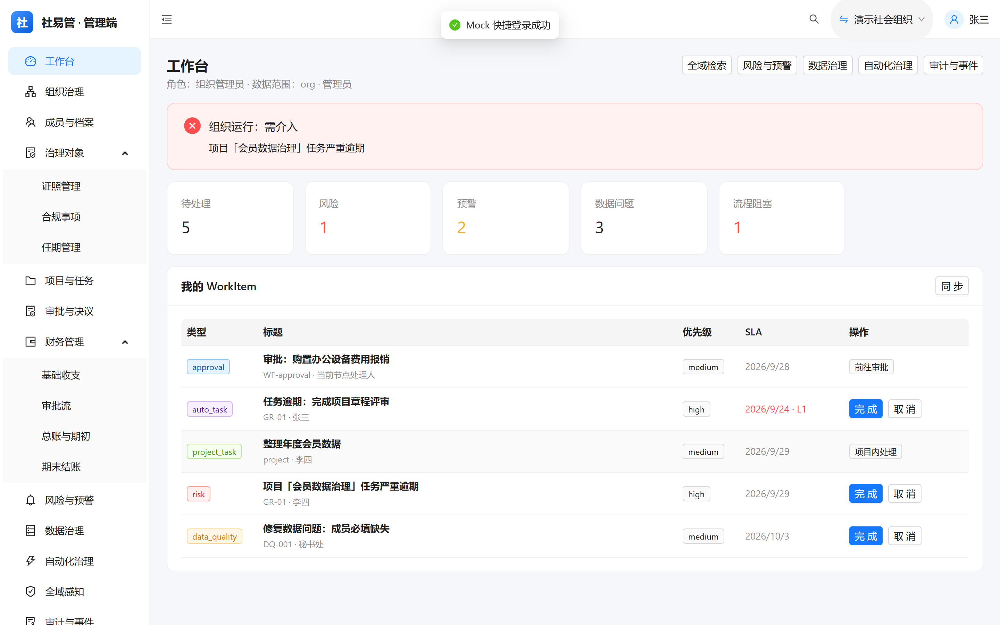
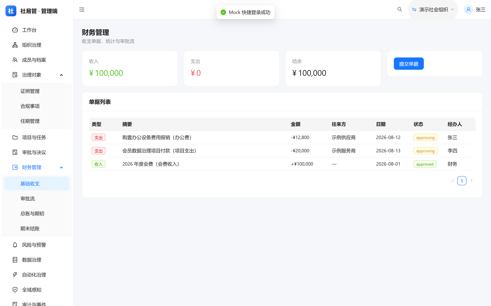
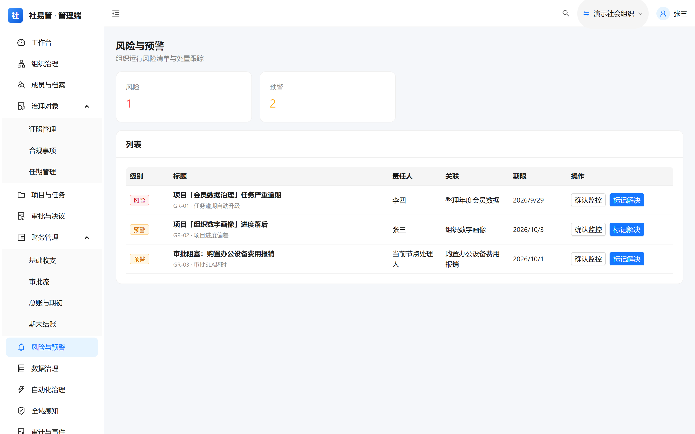
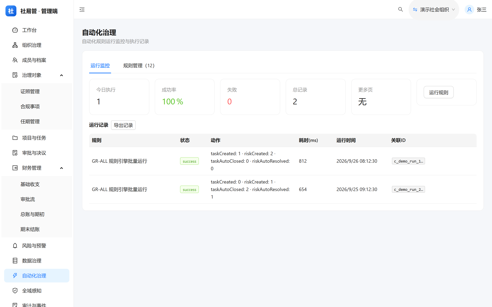

# 社易管（SmartSociety）

<p align="center">
  
</p>

<p align="center">
  
  &nbsp;
  
  &nbsp;
  
  &nbsp;
  
  &nbsp;
  
</p>

**SmartSociety** (社易管) is a multi-organization management platform for campus clubs, volunteer teams, and social organizations. It ships a **Flutter-based HarmonyOS NEXT mobile app** backed by **Huawei AGC Serverless** (cloud functions + cloud database), along with a **React 19 + Ant Design 5 web console** sharing the same business APIs.

Core capabilities include Huawei account sign-in with unified cross-platform identity, multi-organization management with RBAC, offline-first bidirectional sync, non-profit accounting with approval workflows, and an automated governance engine covering business events, data quality, risk alerts, audit logs, and a unified work-item center. The UI follows the DingTalk/Feishu design language with a shared design-token system across web and mobile.

---

## 中文简介

社易管是面向**学校社团、志愿服务队、社会团体**的多组织管理平台，一个华为账号可同时加入并管理多个组织。

- **移动管理端**（HarmonyOS NEXT）：面向社长/队长/会长等管理人员的全量管理能力——组织态势驾驶舱、成员/项目/公告/财务、全域检索、统一待办、风险钻取、组织数字画像、同步中心。
- **Web 管理端**：React 19 + Ant Design 5 管理控制台，与移动端共用同一套云函数业务 API（统一 `{ ret }` 契约、幂等键、correlationId 全链贯通）。
- **华为账号认证**：华为 Account Kit 一键登录 + 手机号/邮箱密码注册登录（scrypt 加盐哈希），端云全链身份透传与跨端统一内部 userId。
- **自动双向同步**：本地优先、离线操作入队、联网自动推送与拉取合并；设置数据（角色名/主题/昵称）云端存储。
- **自动化治理**：规则引擎 GR-01~12 自动生成任务与风险预警、数据质量规则与健康度评分、审计日志与事件关联链。

- 应用显示名：社易管（英文 SmartSociety），包名 `com.hnmrxz.smart_society`
- 文档版本：V3.2.1 · 适用平台：Windows / macOS（开发）、HarmonyOS NEXT（真机，已在华为 Mate 70 Pro+ 验证）

## 目录

- [功能亮点](#功能亮点)
- [截图预览](#截图预览)
- [技术栈](#技术栈)
- [仓库结构](#仓库结构)
- [快速开始](#快速开始)
- [鸿蒙云开发（AGC）配置](#鸿蒙云开发agc配置)
- [云函数总览](#云函数总览)
- [混合通信](#混合通信)
- [同步机制](#同步机制)
- [数据隔离模型](#数据隔离模型)
- [里程碑](#里程碑)
- [常见问题](#常见问题)
- [关键资源](#关键资源)
- [许可证](#许可证)

## 功能亮点

> 完整的功能审视与优化路线见 [`docs/产品审视与优化路线.md`](docs/产品审视与优化路线.md)；云数据契约见 [`docs/云数据契约.md`](docs/云数据契约.md)，业务 API 契约见 [`docs/业务API契约.md`](docs/业务API契约.md)。

- **组织与身份**：三类组织（学校社团/志愿服务队/社会团体）独立注册与管理；华为账号一键登录 + 账密注册；跨端统一身份（ExternalIdentity → userId → Person）；RBAC 角色权限（内置矩阵 + 自定义权限 + 数据范围）；组织层级与父子/伙伴关系共享。
- **业务管理**：成员档案（搜索/角色筛选/CSV 导出与粘贴导入）、项目-任务-里程碑三级管理与状态流转、公告（重要标记/已读）、文件中心（上传/下载/软删）、钉钉通讯录单向同步（部门选择/主部门保留/角色保留/失败重试）。
- **财务管理**：社会团体按《民间非营利组织会计制度》提供会计科目、借贷分录凭证、期初余额（上期结转）、科目余额表、总账/明细账、资产负债表、业务活动表、现金流量表与期末结账/反结账；学校社团/志愿组织提供简化版收支登记；自定义审批流（审批/办理/抄送三类节点，抄送与完成自动生成公告）；单据关联项目预算联动。
- **治理与自动化**：统一业务事件中心（云函数层自动落事件）、数据质量规则（GR 系列之外另有 8 类确定性规则）与健康度评分、规则引擎 GR-01~12（任务逾期升级/进度偏差/审批 SLA/预算超支/职位空缺/证照到期/任期届满/合规逾期等，支持组织级启停）、自动任务与风险预警闭环、决议/证照/合规事项/任期治理对象、审计日志（改前改后 + correlationId 关联链）、组织数字画像（管理健康度加权评分与多维钻取）。
- **统一工作项 WorkItem**：审批/自动任务/项目任务/风险整改/数据治理统一抽象，物化视图 + 统一查询与处理，移动端与 Web 消费同一接口。
- **移动端体验**：组织态势总览（运行状态/待处理/风险/数据问题与"最值得关注"结论）、全域检索、统一待办中心、风险完整钻取、同步中心；全局 UI 对标钉钉/飞书（浅灰画布、白卡细边框、语义功能色、统一圆角字阶、渐变头像、底部 5 Tab + 再按一次退出防抖）。
- **Web 管理端**：核心工作台（工作项/态势/检索/风险/数据质量/自动化/审计）、组织业务（组织/成员/项目/审批决议/财务）、高级治理（规则管理/报表 ECharts/CSV 导出/全域感知）、设置中心（组织设置/角色/数据范围/偏好）、财务高级（期初/总账/结账/报表）、公告管理；开发态 Mock 全链路可跑（68 项冒烟断言），见 [`web/README.md`](web/README.md)。
- **同步与安全**：本地优先 + 30s 周期自动双向同步（失败指数退避重试）；云端权限加固（upsert/delete/get-all-data 统一成员校验，同步自动注入 userId）；关键动作服务端幂等（IdempotencyRecord，24h 有效）。

### 规划中

- 钉钉群消息、审批流（接口已预留）
- 华为推送 Kit（公告推送）、扫码签到（PlatformView）

## 截图预览

Web 管理端（mock 模式，设计令牌对标钉钉/飞书）：

| 登录页 | 工作台 |
|--------|--------|
|  |  |

| 财务管理 | 风险与预警 | 自动化治理 |
|----------|------------|------------|
|  |  |  |

> 移动端截图见 [`screenshots/mobile/`](screenshots/mobile/)（占位，随版本补充）。截图由 `web/scripts/capture-screens.ts` 在 mock dev server 自动采集。

## 技术栈

| 层 | 技术 |
|----|------|
| 移动 UI / 业务 | Flutter（Dart 3.11），Flutter-OH 3.41.10 |
| 原生壳 | HarmonyOS（ArkTS，API 26） |
| Web 管理端 | React 19 + TypeScript strict + Vite 7 + Ant Design 5 + TanStack Query + Zustand |
| 账号认证 | 华为 Account Kit（HuaweiIDProvider + AuthenticationController） |
| 状态管理 | Provider 6（移动端） |
| 路由 | go_router 14（StatefulShellRoute 五 Tab + 认证守卫）；React Router 7（Web） |
| 本地缓存 | Hive（settings / auth / organizations / syncQueue / members / projects / notices） |
| 网络请求 | Dio（移动端）；统一 API Client（Web，{ ret } 契约 + Zod 校验） |
| 云开发 | 华为 AGC Serverless（云函数 + 云数据库） |
| 混合通信 | MethodChannel（存储路径 / 云函数 / 认证桥接） |
| 设计系统 | 双端同源 DesignTokens（Web `web/src/theme/tokens.ts` ↔ 移动 `theme_config.dart`），统一 AppCard / StatusBadge / PageContainer |
| 测试 | Vitest + RTL（Web 单元/组件）、Playwright（Web E2E）、flutter_test（移动冒烟） |

## 仓库结构

项目采用 DevEco Studio **端云一体化** 工程结构；仓库根目录按模块拆分，`mobile/` 为手机端端云一体化工程根（DevEco Studio 打开此目录）：

```
smart_society/                     # 仓库根目录
├── README.md                      # 总说明（本文件）
├── CONTRIBUTING.md                # 参与贡献指南
├── SUPPORTED.md                   # 支持环境矩阵
├── screenshots/                   # 截图与徽章资源
│   ├── badges/                    # 仓库内静态徽章 SVG
│   └── web/                       # Web 端代表页截图
├── docs/                          # 文档
│   ├── AGC部署联调.md              # 云函数部署与联调（部署细节单一信息源）
│   ├── 产品审视与优化路线.md        # 功能审视与优化路线
│   ├── 云数据契约.md / 业务API契约.md
│   └── ...
├── mobile/                        # 手机端 · 端云一体化工程（DevEco Studio 打开此目录）
│   ├── Application/               # 端侧工程（Flutter + HarmonyOS 原生壳）
│   │   ├── lib/                   # Flutter 业务代码
│   │   │   ├── main.dart / app.dart   # 入口，MultiProvider 初始化链路
│   │   │   ├── router.dart            # go_router 配置（认证守卫 + Tab 返回拦截）
│   │   │   ├── config/                # 组织类型、主题 DesignTokens、OrgLabels
│   │   │   ├── models/ / providers/ / screens/ / services/ / widgets/ / utils/
│   │   ├── entry/                # 鸿蒙 entry 模块（EntryAbility.ets 云开发初始化 + 3 个 MethodChannel）
│   │   └── pubspec.yaml
│   └── CloudProgram/               # 云侧工程
│       ├── clouddb/
│       │   ├── objecttype/         # 32 个对象类型定义
│       │   └── dataentry/          # 种子数据
│       └── cloudfunctions/         # 80 个云函数（common/ 为共享模型模块）
└── web/                            # Web 管理端（见 web/README.md）
    ├── src/                        # React 19 + TS strict + AntD5 + 统一 API Client
    ├── mock/                       # 开发态 Mock API（{ ret } 契约）
    ├── scripts/                    # dev-smoke（Mock 冒烟断言）
    └── tests/                      # Vitest + RTL + Playwright
```

> **注意**：`mobile/Application/ohos/` 是 NTFS Junction（目录联结），指向 `mobile/Application/` 自身，供 Flutter 工具链与 `flutter-hvigor-plugin` 解析 `ohos/local.properties`。**DevEco Studio 请打开 `mobile/` 目录**（工程根仅含 `Application/` 与 `CloudProgram/` 两个目录）。

## 快速开始

### 环境要求

| 工具 | 版本 | 备注 |
|------|------|------|
| Flutter-OH | **3.41.10-ohos-1.0.1** | 鸿蒙定制版 |
| Dart SDK | ^3.11.5 | 随 Flutter-OH |
| DevEco Studio | 6.1+ | 安装时勾选 HarmonyOS SDK |
| JDK | 17 | 构建必需 |
| Node.js | 18+ | hvigor/ohpm 依赖；Web 端建议 20+（pnpm） |

环境变量：`DEVECO_SDK_HOME`、`HOS_SDK_HOME`、`PUB_HOSTED_URL=https://pub.flutter-io.cn`、`FLUTTER_STORAGE_BASE_URL=https://storage.flutter-io.cn`。详细支持环境矩阵见 [`SUPPORTED.md`](SUPPORTED.md)。

### 移动端

```bash
cd mobile/Application
flutter pub get
flutter analyze   # 门禁：0 issue
flutter test      # 门禁：全过
flutter run --debug -d <deviceId>
```

首次启动流程：华为账号登录（或账密注册）→ 引导页选择组织类型与主题 → 自动创建首个组织 → 进入主界面。

### Web 管理端

```bash
cd web
pnpm install
pnpm typecheck && pnpm lint && pnpm test && pnpm build   # 四门禁
pnpm smoke                                               # Mock 冒烟（68 项断言）
pnpm dev                                                 # 默认 mock 模式，浏览器打开 http://localhost:5173
```

Mock 模式无需任何云端配置即可完整体验；对接真实 AGC 网关见 [`docs/AGC部署联调.md`](docs/AGC部署联调.md)「四、Web 接入真实网关」。

## 鸿蒙云开发（AGC）配置

### 1. 应用关联

1. AGC 控制台创建项目与应用，**包名必须等于** `com.hnmrxz.smart_society`。
2. 启用数据处理位置（必须含中国站点），开通云开发服务（云函数 + 云数据库）。
3. 开通华为 Account Kit，在 AGC 配置 OAuth 回调。

### 2. 项目侧配置

| 项 | 位置 |
|----|------|
| `agconnect-services.json` | `entry/src/main/resources/rawfile/`（已加入 `.gitignore`） |
| 云开发初始化 + 认证 | `EntryAbility.ets`：`cloudCommon.init({ region: CHINA, authProvider })` |
| 云函数桥接 | `EntryAbility.ets` → `com.smartsociety/cloud` → `cloudFunction.call` |
| 认证桥接 | `EntryAbility.ets` → `com.smartsociety/auth` → 登录/退出/获取用户信息 |
| 存储桥接 | `EntryAbility.ets` → `com.smartsociety/storage` → `getStoragePath` |

### 3. 云数据库

32 个对象类型定义位于 `CloudProgram/clouddb/objecttype/`（对象清单与统一字段契约见 [`docs/云数据契约.md`](docs/云数据契约.md)）：

| 对象类型 | 主键 | 说明 |
|----------|------|------|
| Member / Project / Notice | id | 业务主数据（+orgId 隔离，tasks/milestones 内嵌 JSON） |
| Organization / OrganizationRelationship / UserOrganization | orgId / relId / id | 组织、组织间关系、用户-组织关联 |
| OrgSettings / UserSettings | orgId / userId | 组织级设置（roleLabels、ruleConfig、钉钉凭证）/ 用户级设置 |
| AppUser / ExternalIdentity / Person | id / identityId / personId | 账号、外部身份映射、自然人主档 |
| FinanceRecord / ApprovalFlow / ApprovalInstance / FinanceOpeningBalance | id | 财务单据、审批流、审批实例、期初余额 |
| BusinessEvent / DataQualityIssue / DataQualitySnapshot | id | 业务事件、数据质量问题、健康度快照 |
| AutoTask / RiskAlert / AutomationRunLog / AuditLog | id | 自动任务、风险预警、自动化运行日志、审计日志 |
| IdempotencyRecord / WorkItem | id | 幂等记录、统一工作项 |
| Role / Permission / DataScope | id | RBAC 角色、权限目录、数据范围 |
| Resolution / License / ComplianceItem / Term | id | 决议、证照、合规事项、任期 |
| Document | id | 云存储文件元数据（软删） |

权限配置：World/Authenticated 仅可读，Creator/Administrator 可读写删。端侧不直连云数据库，由云函数服务端 SDK 访问；`OrgSettings` 中的钉钉凭证由 `get-org-settings` 按角色裁剪，普通成员不可见。

### 4. 云函数部署

80 个云函数（HTTP 触发器、POST、认证类型 `apigw-client`，统一返回 `{ ret: { code, message, data } }`）的功能分类见下方[云函数总览](#云函数总览)。**部署步骤、对象类型同步与联调验收清单的单一信息源为 [`docs/AGC部署联调.md`](docs/AGC部署联调.md)**（含 DevEco Studio 图形界面部署、AGC 控制台在线编辑器两种方式与 CLI 不可用结论）。

## 云函数总览

> 本节为云函数**功能分类的唯一全量清单**；部署与联调细节见 [`docs/AGC部署联调.md`](docs/AGC部署联调.md)。

**数据 CRUD（7 个，按 orgId 隔离）**：`get-all-data`（全量拉取 Member/Project/Notice）、`upsert/delete-member`、`upsert/delete-project`（含 tasks/milestones）、`upsert/delete-notice`

**事件中心（2 个）**：`record-business-event`（校验组织成员身份）、`get-business-events`（按对象/类型/级别筛选、倒序分页）

**数据治理（3 个）**：`run-data-quality`（生成/复用/自动关闭问题 + 健康度快照）、`get-data-quality`、`resolve-data-quality-issue`（解决/忽略/重开，结果入事件流）

**自动化治理（4 个）**：`run-governance-rules`（GR-01~12 批量运行，读取 `OrgSettings.ruleConfig` 跳过禁用规则）、`get-governance-center`（任务/风险/运行记录汇总）、`act-auto-task`、`act-risk-alert`

**组织管理（7 个）**：`create-org`（名称唯一性与信用代码校验）、`get-my-orgs`、`join-org`、`set-org-relationship`、`get-org-hierarchy`、`set-org-admin`、`delete-org`（级联删除）

**用户与绑定（2 个）**：`bind-member`（按手机号绑定会员）、`delete-user`（注销账号，级联删除）

**钉钉同步（2 个）**：`dingtalk-sync-contacts`（凭证入参，`d+userid` 幂等批量 upsert）、`dingtalk-list-departments`（部门树）

**财务与审批（7 个）**：`submit-finance-record`（提交并自动发起审批）、`act-finance-node`（通过/驳回/办理，完成时通知）、`get-finance-records`、`get-finance-stats`、`get-approval-tasks`、`save-approval-flow` / `get-approval-flows`

**财务结账与报表（6 个）**：`save/get-opening-balances`（期初录入与上期结转）、`get-accounting-reports`（余额表/资产负债表/业务活动表/现金流量表）、`get-ledger`（总账/明细账）、`close-period`（结转凭证生成）、`unclose-period`（反结账）

**设置（4 个）**：`get/save-org-settings`（钉钉凭证仅 admin 可见）、`get/save-user-settings`

**身份与认证（3 个）**：`register-user` / `login-user`（scrypt 加盐哈希）、`ensure-user-identity`（外部身份 → 内部 userId，幂等）

**权限 RBAC（4 个）**：`get-my-permissions`（云端计算角色/权限/数据范围，回退兼容旧 admin/member）、`get-roles`、`save-role`、`save-data-scope`

**统一工作项（3 个）**：`refresh-work-items`（物化 + 自动关闭消失项）、`get-work-items`、`act-work-item`（完成/取消/重开，同步来源系统）

**审计（2 个）**：`record-audit-log`、`get-audit-logs`（按对象/动作/操作人筛选分页）

**决议与治理对象（12 个）**：`save/get/act-resolution`、`save/get/act-license`、`save/get/act-compliance-item`、`save/get/act-term`

**感知与血缘（2 个）**：`get-trend-stats`（近 7 天趋势与环比异常）、`get-entity-relations`（项目根血缘图）

**文件中心（5 个）**：`init/commit-file-upload`（SDK 直传或代理写入 ≤5MB）、`list-documents`、`get-document-file`（代理下载 ≤10MB）、`delete-document`（软删）

**检索、规则配置与报表（5 个）**：`search-all`（七类对象统一检索，每类≤20 条）、`get-rule-config`（GR-01~12 定义与启停）、`set-rule-enabled`（仅管理员，强制幂等）、`get-automation-logs`、`get-report-stats`（收支趋势/风险分布/质量维度/项目状态聚合）

## 混合通信

| Channel | 方法 | 用途 |
|---------|------|------|
| `com.smartsociety/storage` | `getStoragePath` | 返回 `filesDir`（Hive 落盘路径） |
| `com.smartsociety/cloud` | `callFunction` | 参数 `{ name, data?, timeout? }` → `cloudFunction.call` |
| `com.smartsociety/auth` | `signIn` / `signOut` / `getUserInfo` | 华为 Account Kit 桥接 |

## 同步机制

- **本地优先**：所有写入操作先持久化到 Hive，界面即时响应。
- **操作入队**：每个 save/delete 操作自动入队到 SyncProvider 的持久化队列。
- **周期推送**：30s 定时器自动处理队列，网络不可用时操作保留等待重试（单次失败指数退避 500ms / 1s / 2s，共 3 次）。
- **云端拉取**：推送完成后、启动时与切换组织时自动拉取云端最新数据合并到本地。

## 数据隔离模型

```
用户 A ──┬── 组织 X（admin）── MemberX, ProjectX, NoticeX
         │       └── 子组织 X1（shareMembers=true）→ 可查看 X1 成员
         └── 组织 Y（member）── 仅可见 Y 的数据

用户 B ──── 组织 X（manager）── 与 A 共享 X 的数据（同 orgId）
```

- 所有数据表通过 `orgId` 字段隔离，云函数强制校验用户是否属于该组织。
- 组织关系（`OrganizationRelationship`）控制跨组织共享：`shareMembers`、`shareActivities`、`shareNotices`。

## 里程碑

| 阶段 | 状态 | 交付物 |
|------|------|--------|
| 环境搭建 / 核心 UI / 角色体系 / 本地持久化 | ✅ | Flutter-OH 工程、三模块 + 仪表盘、分级角色、Hive 多盒 |
| 端云一体化 + 云函数云数据库（V2） | ✅ | 7 个云函数 + 3 张表 |
| **多组织架构（V3）** | ✅ | 华为账号认证、多组织管理、自动同步、组织层级 |
| 云函数部署 + 真机联调 | ✅ | 80 个云函数 + 32 张表部署至 AGC |
| 钉钉集成 + 设置数据上云（V3.2） | ✅ | 通讯录单向同步；角色名/钉钉配置/主题/昵称云端存储 |
| **事件中心 / 数据治理 / 自动化治理（V4.1）** | ✅ | 统一事件模型、质量规则与健康度、规则引擎 + 任务/风险中心 + 运行审计 |
| **组织态势 / 移动端体验 / 组织数字画像（V4.1）** | ✅ | 管理驾驶舱、全域检索、统一待办、风险钻取、同步中心、画像钻取 |
| **Web 管理端（W0~W4）** | ✅ | React19 管理台全功能 + 真实认证链；Mock 68 项冒烟断言全绿 |
| **治理规则启停与收尾（V4.2）** | ✅ | ruleConfig 启停、5 个新云函数（共 80 个）、AGC 部署联调文档、移动端缺陷清零 |
| **UI 现代化（V4.3）** | ✅ | 双端设计令牌同源（#1677FF 系）、Web 布局对标钉钉/飞书、移动端卡片流强化、返回键行为审计 |
| 测试优化 | ⏳ | 功能回归、性能、兼容性 |
| 打包上架 | ⏳ | 签名证书、隐私政策、上架审核 |

## 常见问题

> 云函数部署、AGC 联调、Web 对接真实网关类问题的**单一信息源**为 [`docs/AGC部署联调.md`](docs/AGC部署联调.md)（含 CLI 不可用结论、手动部署两种方式与验收清单）。

| 问题 | 解决方案 |
|------|----------|
| `flutter doctor` 报 OpenHarmony toolchain 缺失 | 检查 `DEVECO_SDK_HOME` / `HOS_SDK_HOME` |
| 真机签名失效 | DevEco → Project Structure → Signing Configs 重新生成 |
| DevEco 不显示 CloudProgram | 用 DevEco 打开 `mobile/` 目录，确保其下仅有 `Application/` + `CloudProgram/` |
| 云函数调用报 `160404` / `2047` / 权限错误 | 见 [`docs/AGC部署联调.md`](docs/AGC部署联调.md) 部署与验收章节 |
| 想用命令行部署云函数 | 当前工具链不可行，需 DevEco Studio Deploy 或 AGC 在线编辑器，见 [`docs/AGC部署联调.md`](docs/AGC部署联调.md)「三、CLI 部署不可用说明」 |
| Web 如何对接真实 AGC 网关 | `VITE_API_MODE=agc` + `VITE_API_BASE_URL`，见 [`docs/AGC部署联调.md`](docs/AGC部署联调.md)「四、Web 接入真实网关」 |
| 华为账号登录失败 | 确认 AGC 已开通 Account Kit、OAuth 回调已配置 |
| 同步队列堆积 | 检查网络连接，恢复后 30s 周期内自动推送 |
| 设置保存报"保存失败" / 报缺参 | 设置保存必须先云端成功后本地生效；检查网络与 get/save-org-settings、get/save-user-settings 是否已部署 |
| 设置页点击"保存"无反应 | 事件回调中应使用 `context.labelsRead`（`read` 版本），不能在事件回调中 `context.watch` |
| `flutter test` 挂起无输出 | 测试内真实 IO（如 `Hive.openBox`）必须包在 `tester.runAsync()` 中执行 |
| Web 开发态接口如何 Mock | 默认 `VITE_API_MODE=mock`，`pnpm smoke` 校验 68 项断言；契约见 `web/src/mock/` |

## 关键资源

| 资源 | 地址 |
|------|------|
| Flutter-OH SDK | https://gitcode.com/openharmony-tpc/flutter_flutter |
| Flutter-OH 混编 Demo | https://gitcode.com/openharmony-tpc/flutter_samples |
| 华为开发者联盟 | https://developer.huawei.com/consumer/cn/ |
| AppGallery Connect | https://developer.huawei.com/consumer/cn/service/josp/agc/index.html |
| 云开发（Serverless）文档 | https://developer.huawei.com/consumer/cn/doc/harmonyos-guides/agc-harmonyos-clouddev-createproject |
| 华为 Account Kit | https://developer.huawei.com/consumer/cn/doc/harmonyos-guides/account-kit-overview |

## 许可证

本项目基于 **GPL-3.0** 许可证发布，全文见 [`LICENSE`](LICENSE)。贡献内容将遵循同一许可证授权（详见 [`CONTRIBUTING.md`](CONTRIBUTING.md)）。
