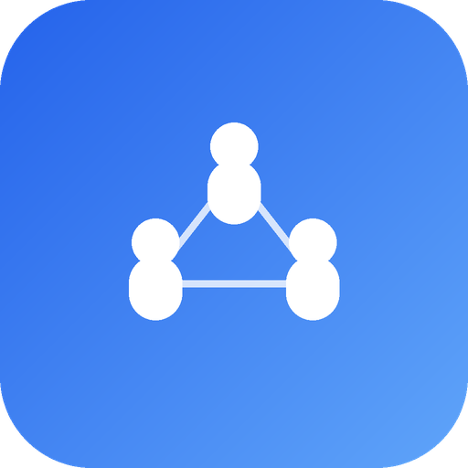

# 社易管（SmartSociety）

<p align="center">
  
</p>

基于 **Flutter + HarmonyOS 混合开发** 的多组织社团管理平台，支持华为账号登录、多组织管理、自动双向同步、组织层级与数据共享。

- 应用显示名：社易管（英文 SmartSociety），包名 `com.hnmrxz.smart_society`
- 文档版本：V3.2.1
- 适用平台：Windows / macOS（开发），HarmonyOS NEXT（真机）
- 真机验证：华为 Mate 70 Pro+（HarmonyOS NEXT）

## 产品定位

- **多组织 SaaS 平台**：支持学校社团、志愿服务队、社会团体三类组织独立注册与管理，同一华为账号可加入多个组织。
- **移动管理端**：面向社长/队长/会长等管理人员，提供成员、项目、公告的全量管理能力。
- **华为账号认证**：集成华为 Account Kit，用户使用华为账号一键登录，端云全链路身份透传；同时支持手机号/邮箱密码注册登录（scrypt 加盐哈希存储，注销账号联动删除）
- **自动双向同步**：离线操作入队，联网后自动推送；云端数据变更可拉取合并，无需手动触发。
- **设置数据上云**：角色自定义名 / 钉钉配置 / 主题 / 昵称全部云端存储，换设备或重新登录自动恢复；角色名按组织独立存储，钉钉凭证仅组织管理员可见。

## 技术栈

| 层 | 技术 |
|----|------|
| UI / 业务 | Flutter（Dart 3.11），Flutter-OH 3.41.10 |
| 原生壳 | HarmonyOS（ArkTS，API 26） |
| 账号认证 | 华为 Account Kit（HuaweiIDProvider + AuthenticationController） |
| 状态管理 | Provider 6 |
| 路由 | go_router 14（StatefulShellRoute 四 Tab + 认证守卫） |
| 本地缓存 | Hive（settings / auth / organizations / syncQueue / members / projects / notices） |
| 网络请求 | Dio |
| 云开发 | 华为 AGC Serverless（云函数 + 云数据库） |
| 混合通信 | MethodChannel（存储路径 / 云函数 / 认证桥接） |
| UI 组件 | 自研 AppCard / StatusBadge / AppEmptyState / AppTheme |

## 功能清单

### 已实现（V3.2）

- **华为账号认证**：一键登录/退出，用户身份端云透传（`cloudCommon.init(authProvider)`）
- **多组织管理**：创建组织（学校社团/志愿服务队→自动生成 ID，社会团体→统一社会信用代码）、切换组织、加入已有组织
- **组织类型**：学校社团、志愿服务队、社会团体，引导页首次选择后自动创建首个组织
- **主题**：校园风（蓝）、青年风（紫）、公益红（红，合并原志愿/政务）；主题色按组织保存（管理员设置，成员共用），黑色深色模式为个人偏好（云端同步，仅影响本人设备）
- **角色体系**：分级角色 + 人数上限约束，名称可在设置中自定义，按组织独立存储并云端同步（`OrgSettings.roleLabels`）
  - 学校社团：社长(1)、部长(不限)
  - 志愿服务队：队长(1)、部长(不限)
  - 社会团体：会长(1)、副会长(不限)、秘书长(1)、理事(不限)、监事长(1)、监事(不限)
- **成员管理**：列表（搜索/角色筛选）、详情、新增/编辑、删除，按 orgId 隔离
- **项目管理**：项目/任务/里程碑三级管理、状态流转（筹备中→进行中→已暂停→已完成）、进度自动计算、任务指派负责人，按 orgId 隔离
- **通知公告**：发布、重要标记、已读状态，按 orgId 隔离
- **管理仪表盘**：成员总数 / 进行中项目 / 未读通知 / 同步状态统计
- **自动双向同步**：离线操作本地持久化 + 云端队列推送，30s 周期自动同步，失败操作保留在队列中等待重试；启动与切换组织时自动拉取云端数据落库
- **组织层级**：父-子组织和合作伙伴关系，支持成员/项目/公告选择性共享
- **多语言文案体系**：全部 UI 文案经 `OrgLabels` 按组织类型分发
- **钉钉通讯录单向同步**：按组织配置钉钉 Client ID/Secret，同步前可选择要同步的钉钉组织（部门，支持取消勾选下级部门以排除）；入会时间取钉钉入职日期（hired_date）；会员编号按（入会时间, 姓名）排序从 1 开始递增（部分部门同步时保留原编号）；全量同步会删除钉钉中已不存在的同步成员并清理账号绑定；拉取失败自动重试、仍失败即中止（不静默丢人）；一人多部门全部保存（`departments`），`department` 为主部门，可手动指定主部门并保留；支持变更成员角色（重新同步时保留人工调整值），同步默认分配普通成员（社员/队员/会员）
- **财务管理**：社会团体按《民间非营利组织会计制度》提供会计科目、记账凭证（借贷分录、平衡校验）、期初余额（支持从上期期末结转）、科目余额表、总账/明细账、资产负债表、业务活动表（限定/非限定）、现金流量表与期末结账（自动生成结转凭证）；学校社团/志愿组织提供简化版收支登记；财务单据可关联项目（项目预算/支出联动），并接入自定义审批流程（审批/办理/抄送三类节点），抄送与完成结果自动生成通知公告
- **事件中心（WF-01）**：统一业务事件模型（创建/提交/审批/驳回/通过/变更/完成/删除/状态变化等），成员/项目/任务/通知/财务单据/审批流程/结账等业务动作在云函数层自动落事件；端侧提供组织事件流页（按业务对象/级别筛选、分页、事件详情与元数据），首页集成“组织动态”入口
- **数据治理中心（DQ-02）**：确定性数据质量规则（必填缺失/无效联系方式/重复成员/日期逻辑/负责人不存在/已结束项目未完成任务/任务逾期/财务缺少关联/预算超支/组织资料缺失），自动生成并复用/关闭问题；健康度评分（按维度）+ 问题清单闭环（解决/忽略/重开，处理结果自动进入事件流），首页集成“数据治理健康度”卡片
- **自动任务与风险预警（WF-03/04、SA-02/03、SEC-01）**：轻量规则引擎（GR-01~08：任务逾期自动升级、项目进度偏差/延期、审批SLA超时、数据质量自动任务、预算超支、关键治理职位空缺、审批驳回异常、项目长期未更新），自动生成并升级自动任务与风险/预警（区分风险与预警，去重、自动关闭已恢复项）；自动任务中心（可解释来源规则/SLA/升级路径，完成/取消/重开闭环）+ 风险预警中心（确认监控/标记解决）+ 自动化运行审计日志（每次运行的任务/风险变更与耗时）；首页集成“风险预警”概览卡与自动任务入口
- **工作台看板与 UI 设计语言**：工作台首页集成全览看板（成员/进行中项目/未读通知/待办统计、我的任务逾期与到期提醒、财务收支概览、预算预警、快捷入口、最近动态）；项目详情支持任务看板（待办/进行中/已完成三列、状态流转）；底部导航 5 栏（首页/成员/项目/通知/财务）；全局主题对标钉钉/飞书（浅灰画布、白卡细边框、语义化功能色、统一圆角与字阶、渐变头像、浮动圆角提示）。完整审视与优化路线见 `docs/产品审视与优化路线.md`
- **组织态势总览（APP-01/SA-01）**：工作台顶部升级为“组织态势 → 必须处理 → 流程阻塞 → 财务概览 → 快捷入口 → 组织动态”，态势卡给出组织运行状态（正常/关注/需介入）、待处理/风险/预警/数据问题计数与“当前最值得关注”结论清单，所有指标可点击钻取到对应中心
- **移动端体验（APP-02/03/04、同步中心）**：顶部新增全域检索入口（跨成员/项目/任务/公告/自动任务/风险/事件统一搜索并钻取）；待办中心统一聚合审批待办、自动任务与我的项目任务；风险详情页支持“风险→原因→关联对象→责任人→处理动作”完整钻取；同步中心展示数据状态、最近同步、待同步队列与同步原则，支持手动立即同步
- **组织数字画像（P1）**：管理健康度（数据质量/流程效率/风险状态/财务健康/项目执行加权评分）+ 组织规模、会员结构、项目执行、财务与流程、风险与数据维度钻取，每一分可追溯到真实业务模块；入口位于“我的”
- **云端权限安全加固（Web 前置）**：upsert/delete（成员/项目/公告）、get-all-data、组织层级/关系、钉钉凭证接口统一增加云端成员校验，组织关系与钉钉凭证进一步要求管理员；同步队列与拉取自动注入 userId，杜绝按 id/orgId 越权读写
- **审计日志（Web 前置）**：新增 AuditLog 对象（action/对象/操作人/改前改后/变更原因/关联ID），record/get-audit-log 云函数；成员/项目/公告增删改、财务提交/审批/驳回/结账/反结账等 10 个关键业务函数自动落审计，支持按对象/动作/操作人筛选分页
- **事件关联链路（Web 前置）**：correlationId 全链贯通——业务动作（财务提交/审批/结账/反结账、自动任务、风险处置、数据治理、工作项处理）生成关联键并写入 BusinessEvent 与 AuditLog；规则引擎生成的自动任务/风险、工作项物化视图携带同一关联键；事件详情页可查看关联ID；云数据契约冻结于 `docs/云数据契约.md`
- **跨端统一身份（Web 前置）**：按身份规范新增 ExternalIdentity 对象与 ensure-user-identity 云函数（provider+providerSubject → 稳定内部 userId，幂等）；密码账号 AppUser.id 即内部 userId，华为账号 OpenID 不再直接充当业务主键
- **统一业务 API 与服务端幂等（Web 前置）**：业务动作命名规范（submit/approve/reject/done/close/unclose/resolve/ack/reopen）与幂等契约冻结于 `docs/业务API契约.md`；财务提交/审批/结账/反结账、自动任务、风险处置、数据问题闭环共 7 个关键动作接入 IdempotencyRecord（同键重试返回首次结果，24h 有效），客户端自动生成幂等键
- **统一工作项 WorkItem（P0-A）**：审批/自动任务/项目任务/风险整改/数据治理统一抽象为 WorkItem（对象含类型/来源/负责人/优先级/SLA/升级/完成条件）；refresh-work-items 从来源业务物化视图并自动关闭已消失项，get-work-items 统一查询，act-work-item 统一处理（自动任务/风险/数据治理同步来源，审批/项目任务跳转来源系统）；移动端新增统一工作项页，Web 直接消费同一接口
- **跨端统一身份客户端落地（P0-B）**：华为登录后自动调用 ensure-user-identity 换取内部 userId，客户端全部业务调用改为使用内部 userId（原 19 处 openId 用法已替换，openId 仅保留为外部身份映射）；新增 Person 对象（personId+userId 主档），AppUser 增加 personId 字段，形成 ExternalIdentity → userId → Person 链路
- **RBAC 第一版（P0-C）**：新增 Role（内置角色矩阵+自定义权限 JSON）/ Permission（权限目录）/ DataScope（数据范围）对象；UserOrganization 增强为组织成员关系（roleId/dataScope/status）；get-my-permissions 云端计算角色/权限/数据范围（回退兼容旧 admin/member），get-roles/save-role/save-data-scope 供管理员配置；客户端权限框架已接入（我的页管理操作按权限码门禁）
- **成员数据管理**：支持 CSV 导出与粘贴导入（钉钉托管组织仅可导出）；财务支持反结账（撤销结转凭证，恢复年度录入）
- **设置数据上云**：角色自定义名 / 钉钉配置 / 主题 / 昵称全部云端存储（`OrgSettings` / `UserSettings` 表），换设备或重新登录自动恢复；钉钉凭证仅组织管理员可见，普通成员只读同步状态；离线保存设置提示失败，读取用本地缓存兜底

### 规划中

- 钉钉群消息、审批流（接口已预留）
- 华为推送 Kit（公告推送）、扫码签到（PlatformView）
- Web 管理后台：**W0 工程底座已搭建**（React19+TS strict+Vite7+AntD5+TanStack Query+Zustand+统一 API Client+权限守卫+测试基建，见 `web/README.md`）；核心业务页面待 AGC 部署与集成验证后按 W1→W3 实施（门禁详见 `docs/Web开发前审核报告.md` §〇）

## 仓库结构

项目采用 DevEco Studio **端云一体化** 工程结构；仓库根目录按模块拆分，`mobile/` 为手机端端云一体化工程根（DevEco Studio 打开此目录）：

```
smart_society/                     # 仓库根目录
├── .gitignore
├── README.md                      # 总说明（本文件）
├── docs/                          # 文档
│   └── 产品审视与优化路线.md       # 功能审视与优化路线
├── mobile/                        # 手机端 · 端云一体化工程（DevEco Studio 打开此目录）
│   ├── .gitignore
│   ├── Application/               # 端侧工程（Flutter + HarmonyOS 原生壳）
│   │   ├── lib/                   # Flutter 业务代码
│   │   │   ├── main.dart / app.dart   # 入口，MultiProvider 初始化链路
│   │   │   ├── router.dart            # go_router 配置（含认证守卫 + 组织路由）
│   │   │   ├── config/                # 组织类型、主题、OrgLabels / FinanceLabels
│   │   │   ├── models/                # Member / Project / Notice / AuthUser / 财务与审批
│   │   │   ├── providers/             # Settings / Auth / Organization / Sync / Finance
│   │   │   ├── screens/               # auth / org / member / project / notice / finance / home / profile / settings
│   │   │   ├── services/              # auth / cloud_function / storage / api_client / dingtalk
│   │   │   ├── widgets/               # AppCard / StatusBadge / AppEmptyState / AppTheme
│   │   │   └── utils/
│   │   ├── entry/                  # 鸿蒙 entry 模块
│   │   │   └── src/main/ets/
│   │   │       ├── entryability/EntryAbility.ets   # 云开发初始化 + 3 个 MethodChannel
│   │   │       └── resources/rawfile/agconnect-services.json
│   │   ├── AppScope/
│   │   ├── build-profile.json5
│   │   ├── ohos/                   # → mobile/Application/ 自身（NTFS Junction）
│   │   └── pubspec.yaml
│   └── CloudProgram/               # 云侧工程
│       ├── cloud-config.json
│       ├── clouddb/
│       │   ├── db-config.json
│       │   ├── objecttype/         # 27 个对象类型定义（Member/Project/Notice/Org/Finance/BusinessEvent/质量/自动化/审计/身份/幂等/工作项/权限等）
│       │   └── dataentry/          # 种子数据
│       └── cloudfunctions/         # 56 个云函数（含注册登录、财务、审批、结账、事件中心、数据治理、自动化治理、审计、身份、权限等）
└── web/                            # 网页端（规划中）
    └── README.md
```

> **注意**：`mobile/Application/ohos/` 是 NTFS Junction（目录联结），指向 `mobile/Application/` 自身，供 Flutter 工具链（`flutter build/run`）与 `flutter-hvigor-plugin` 解析 `ohos/local.properties`。**DevEco Studio 请打开 `mobile/` 目录**（工程根仅含 `Application/` 与 `CloudProgram/` 两个目录，不含其他文件）；仓库根目录按模块拆分，不直接作为 DevEco 工程根。

## 环境要求

| 工具 | 版本 | 备注 |
|------|------|------|
| Flutter-OH | **3.41.10-ohos-1.0.0** | 鸿蒙定制版 |
| Dart SDK | ^3.11.5 | 随 Flutter-OH |
| DevEco Studio | 6.1+ | 安装时勾选 HarmonyOS SDK |
| JDK | 17 | 构建必需 |
| Node.js | 18+ | hvigor/ohpm 依赖 |

环境变量：`DEVECO_SDK_HOME`、`HOS_SDK_HOME`、`PUB_HOSTED_URL=https://pub.flutter-io.cn`、`FLUTTER_STORAGE_BASE_URL=https://storage.flutter-io.cn`。

## 快速开始

```bash
cd mobile/Application
flutter doctor -v
flutter pub get
flutter analyze
flutter run --debug -d <deviceId>
```

首次启动流程：华为账号登录 → 引导页选择组织类型与主题 → 自动创建首个组织 → 进入主界面。

## 鸿蒙云开发（AGC）配置

### 1. 应用关联

1. AGC 控制台创建项目与应用，**包名必须等于** `com.hnmrxz.smart_society`。
2. 启用数据处理位置（必须含中国站点），开通云开发服务（云函数 + 云数据库）。
3. 开通华为 Account Kit，在 AGC 配置 OAuth 回调。

### 2. 项目侧配置

| 项 | 位置 |
|----|------|
| `agconnect-services.json` | `entry/src/main/resources/rawfile/`（已加入 `.gitignore`） |
| 云开发初始化 + 认证 | `EntryAbility.ets`：`cloudCommon.init({ region: CHINA, authProvider })` |
| 云函数桥接 | `EntryAbility.ets` → `com.smartsociety/cloud` → `cloudFunction.call` |
| 认证桥接 | `EntryAbility.ets` → `com.smartsociety/auth` → 登录/退出/获取用户信息 |
| 存储桥接 | `EntryAbility.ets` → `com.smartsociety/storage` → `getStoragePath` |

### 3. 云数据库

27 个对象类型定义位于 `CloudProgram/clouddb/objecttype/`：

| 对象类型 | 主键 | 说明 |
|----------|------|------|
| Member | id | 成员（+orgId 隔离） |
| Project | id | 项目（+orgId 隔离，tasks/milestones 内嵌为 JSON 字符串） |
| Notice | id | 公告（+orgId 隔离） |
| Organization | orgId | 组织信息 |
| OrganizationRelationship | relId | 组织间关系 |
| UserOrganization | id | 用户-组织关联 |
| OrgSettings | orgId | 组织级设置（roleLabels 为 JSON 字符串、钉钉凭证与同步记录） |
| UserSettings | userId | 用户级设置（主题序号、昵称） |
| FinanceRecord | id | 财务单据（收支单/记账凭证，含借贷分录、审批状态） |
| ApprovalFlow | id | 审批流程定义（节点含审批/办理/抄送） |
| ApprovalInstance | id | 审批实例（当前节点、处理记录，抄送/完成生成通知） |
| FinanceOpeningBalance | id | 会计科目期初余额（按年度） |
| BusinessEvent | id | 统一业务事件（orgId 隔离，含事件类型/对象/操作人/级别/元数据） |
| DataQualityIssue | id | 数据质量问题（规则/实体/严重度/状态/检查次数） |
| DataQualitySnapshot | id | 数据治理健康度快照（总分/维度分/计数） |
| AutoTask | id | 自动任务（来源规则/SLA/升级路径/状态） |
| RiskAlert | id | 风险与预警（kind 区分风险/预警，责任人/期限/状态） |
| AutomationRunLog | id | 自动化运行审计日志（动作/耗时/结果） |
| AuditLog | id | 审计日志（改前改后/操作人/变更原因/关联ID） |
| ExternalIdentity | identityId | 外部身份映射（provider+providerSubject → 内部 userId） |
| IdempotencyRecord | id=幂等键 | 业务动作幂等记录（action/entity/result/有效期） |
| WorkItem | id | 统一工作项（类型/来源/负责人/SLA/完成条件） |
| Person | personId | 自然人主档（userId 关联，基础身份） |
| Role | id | 组织角色（内置矩阵+自定义权限 JSON/数据范围） |
| Permission | id | 权限目录（code/name/category） |
| DataScope | id | 数据范围（角色级/用户级覆盖） |

权限配置：World/Authenticated 仅可读，Creator/Administrator 可读写删。端侧不直连云数据库，由云函数服务端 SDK 访问；`OrgSettings` 中的钉钉凭证由 `get-org-settings` 按角色裁剪，普通成员不可见。

### 4. 云函数

56 个云函数，HTTP 触发器、POST、认证类型 `apigw-client`，统一返回 `{ ret: { code, message, data } }`。

**数据 CRUD（7 个，按 orgId 隔离）**：

| 函数 | 说明 |
|------|------|
| `get-all-data` | 全量拉取 Member / Project / Notice（按 orgId 过滤） |
| `upsert-member` / `delete-member` | 成员 upsert / 删除 |
| `upsert-project` / `delete-project` | 项目 upsert（含 tasks/milestones）/ 删除 |
| `upsert-notice` / `delete-notice` | 公告 upsert / 删除 |

**事件中心（2 个）**：

| 函数 | 说明 |
|------|------|
| `record-business-event` | 记录一条业务事件（校验组织成员身份） |
| `get-business-events` | 组织事件流查询（按对象/事件类型/级别筛选、倒序分页） |

**数据治理（3 个）**：

| 函数 | 说明 |
|------|------|
| `run-data-quality` | 运行数据质量规则，生成/复用/自动关闭问题，计算健康度快照 |
| `get-data-quality` | 健康度快照 + 问题清单（按分类/状态筛选、分页） |
| `resolve-data-quality-issue` | 数据问题闭环（解决/忽略/重开），处理结果写入事件流 |

**自动化治理（4 个）**：

| 函数 | 说明 |
|------|------|
| `run-governance-rules` | 规则引擎批量运行（逾期升级/进度偏差/审批SLA/数据质量任务/预算超支），生成任务与风险并写审计日志 |
| `get-governance-center` | 自动任务 + 风险/预警 + 自动化运行记录汇总 |
| `act-auto-task` | 自动任务处理（完成/取消/重开），结果写入事件流 |
| `act-risk-alert` | 风险/预警处理（标记解决/确认监控/重开），结果写入事件流 |

**组织管理（7 个）**：

| 函数 | 说明 |
|------|------|
| `create-org` | 创建组织（校验名称唯一性、信用代码格式），自动添加创建者为管理员 |
| `get-my-orgs` | 获取当前用户所属所有组织及角色 |
| `join-org` | 加入已有组织 |
| `set-org-relationship` | 设置父-子或伙伴关系及数据共享策略 |
| `get-org-hierarchy` | 获取组织层级树 |
| `set-org-admin` | 变更组织管理员 |
| `delete-org` | 注销组织，级联删除该组织全部数据与设置 |

**用户与绑定（2 个）**：

| 函数 | 说明 |
|------|------|
| `bind-member` | 按手机号绑定会员 |
| `delete-user` | 注销账号，级联删除所属组织（唯一账号时）与用户设置 |

**钉钉同步（1 个）**：

| 函数 | 说明 |
|------|------|
| `dingtalk-sync-contacts` | 钉钉通讯录单向同步（凭证入参，`d+userid` 幂等批量 upsert） |
| `dingtalk-list-departments` | 获取钉钉组织架构（部门树），同步前选择要同步的组织 |

**财务与审批（7 个）**：
| 函数 | 说明 |
|------|------|
| `submit-finance-record` | 提交财务单据（收支/记账凭证），自动发起审批流程并生成抄送通知 |
| `act-finance-node` | 审批通过/驳回、办理完成；推进流程节点，完成时更新单据状态并通知 |
| `get-finance-records` | 财务单据列表/详情（含我可操作标记） |
| `get-finance-stats` | 收入/费用/结余汇总、按科目与按项目统计（收入费用表） |
| `get-approval-tasks` | 我的待办（当前节点处理人） |
| `save-approval-flow` / `get-approval-flows` | 审批流程定义保存（仅管理员）与列表 |

**财务结账与报表（5 个）**：
| 函数 | 说明 |
|------|------|
| `save-opening-balances` / `get-opening-balances` | 期初余额录入（仅管理员），支持从上期期末一键结转 |
| `get-accounting-reports` | 科目余额表、资产负债表、业务活动表（限定/非限定）、现金流量表 |
| `get-ledger` | 总账/明细账（按科目，含期初与逐笔余额） |
| `close-period` | 期末结账：收入/费用结转至净资产，生成结转凭证并通知（仅管理员） |

**设置（4 个，新增）**：

| 函数 | 说明 |
|------|------|
| `get-org-settings` | 读取组织设置；校验成员身份，钉钉凭证仅 admin 可见，member 仅返回配置状态与同步记录 |
| `save-org-settings` | 保存组织设置（仅管理员）；roleLabels 以 JSON 字符串存储 |
| `get-user-settings` | 读取用户设置（主题/昵称） |
| `save-user-settings` | 保存用户设置 |

## 混合通信

| Channel | 方法 | 用途 |
|---------|------|------|
| `com.smartsociety/storage` | `getStoragePath` | 返回 `filesDir`（Hive 落盘路径） |
| `com.smartsociety/cloud` | `callFunction` | 参数 `{ name, data?, timeout? }` → `cloudFunction.call` |
| `com.smartsociety/auth` | `signIn` / `signOut` / `getUserInfo` | 华为 Account Kit 桥接 |

## 同步机制

- **本地优先**：所有写入操作先持久化到 Hive，界面即时响应。
- **操作入队**：每个 save/delete 操作自动入队到 SyncProvider 的持久化队列。
- **周期推送**：30s 定时器自动处理队列，网络不可用时操作保留在队列中等待。
- **云端拉取**：`flush()` 在推送完成后自动拉取云端最新数据合并到本地；启动与切换组织时同样自动拉取。
- **重试策略**：单次云函数调用失败时自动重试 3 次（指数退避 500ms / 1000ms / 2000ms）。
- **全自动同步**：所有增删改操作自动入队推送，无手动同步入口。

## 数据隔离模型

```
用户 A ──┬── 组织 X（admin）── MemberX, ProjectX, NoticeX
         │       └── 子组织 X1（shareMembers=true）→ 可查看 X1 成员
         └── 组织 Y（member）── 仅可见 Y 的数据

用户 B ──── 组织 X（manager）── 与 A 共享 X 的数据（同 orgId）
```

- 所有数据表通过 `orgId` 字段隔离，云函数强制校验用户是否属于该组织。
- 组织关系（`OrganizationRelationship`）控制跨组织数据共享：`shareMembers`、`shareActivities`、`shareNotices` 分别控制成员/活动/公告的可见性。

## 里程碑

| 阶段 | 状态 | 交付物 |
|------|------|--------|
| 环境搭建 / 项目初始化 | ✅ | Flutter-OH + DevEco 工程，真机运行 |
| 核心 UI（三模块 + 仪表盘） | ✅ | 成员/项目/公告/设置页 |
| 角色体系与文案重构 | ✅ | 分级角色、自定义角色名、OrgLabels |
| 本地持久化 | ✅ | Hive 多盒存储 |
| 端云一体化工程结构 | ✅ | mobile/Application/ + mobile/CloudProgram/ |
| 云函数 + 云数据库（V2） | ✅ | 7 个云函数 + 3 张表 |
| **多组织架构（V3）** | ✅ | 华为账号认证、多组织管理、自动同步、组织层级 |
| 云函数部署 + 真机联调 | ✅ | 56 个云函数 + 27 张表部署至 AGC |
| 钉钉集成 | ✅ | 通讯录单向同步（按组织配置凭证、成员只读）；群消息/审批流待后续 |
| **设置数据上云（V3.2）** | ✅ | 角色名/钉钉配置/主题/昵称云端存储，按组织隔离，凭证仅管理员可见 |
| **事件中心（V4.1）** | ✅ | 统一业务事件模型 + 云函数自动落事件 + 组织事件流页 |
| **数据治理中心（V4.1）** | ✅ | 质量规则 + 健康度评分 + 问题闭环 + 首页健康度卡 |
| **自动化治理（V4.1）** | ✅ | 规则引擎 + 自动任务 + 风险/预警中心 + 运行审计 |
| **组织态势总览（V4.1）** | ✅ | 工作台从“统计卡片”升级为“从数据到结论”的管理驾驶舱 |
| **移动端体验（V4.1）** | ✅ | 全域检索 + 统一待办 + 风险钻取 + 同步中心 |
| **组织数字画像（V4.1）** | ✅ | 管理健康度评分 + 规模/会员/项目/财务/流程/风险/数据钻取 |
| 测试优化 | ⏳ | 功能回归、性能、兼容性 |
| 打包上架 | ⏳ | 签名证书、隐私政策、上架审核 |

## 常见问题

| 问题 | 解决方案 |
|------|----------|
| `flutter doctor` 报 OpenHarmony toolchain 缺失 | 检查 `DEVECO_SDK_HOME` / `HOS_SDK_HOME` |
| 真机签名失效 | DevEco → Project Structure → Signing Configs 重新生成 |
| DevEco 不显示 CloudProgram | 用 DevEco 打开 `mobile/` 目录，确保其下仅有 `Application/` + `CloudProgram/` |
| 云函数调用报 `160404: Trigger not exist` | 函数未部署，在 DevEco 中重新部署 |
| 云函数报 `2047: the input class is invalid` | 模型类未实现 CloudDB SDK 要求的 5 个方法 |
| 云函数报权限错误 | 确认认证类型为 `apigw-client`、证书指纹已登记 |
| 华为账号登录失败 | 确认 AGC 已开通 Account Kit、OAuth 回调已配置 |
| 同步队列堆积 | 检查网络连接，恢复后 30s 周期内自动推送 |
| MethodChannel 通信失败 | 核对 Dart 与 ArkTS 两端 Channel 名称、参数 key 完全一致 |
| 云数据库部署报 `Failed to decode response body. createDataBaseResource` | 多为云数据库服务未开通/登录态失效/网络代理拦截；先在 AGC 控制台确认云数据库已开通、DevEco 重新登录，再重试部署 |
| 设置保存报"保存失败" | 设置保存必须先云端成功后本地生效，检查网络与云函数是否已部署（get/save-org-settings、get/save-user-settings） |
| 设置页点击"保存"无反应 / 设置数据不上云 | 事件回调中误用 `context.labels`（内部为 `context.watch`，只能在 build 方法中调用）会在调试模式抛错且被吞掉；事件回调应使用 `context.labelsRead`（`read` 版本）。已修复设置页与成员/项目/公告表单页 |
| 登录后保存设置报"缺少 orgId/userId 参数" | Provider 的 userId 原仅在启动时初始化，冷启动未登录、之后再登录时仍为空；已增加登录态监听，登录后自动同步 userId 并重新拉取云端用户/组织设置 |

## 关键资源

| 资源 | 地址 |
|------|------|
| Flutter-OH SDK | https://gitcode.com/openharmony-tpc/flutter_flutter |
| Flutter-OH 混编 Demo | https://gitcode.com/openharmony-tpc/flutter_samples |
| 华为开发者联盟 | https://developer.huawei.com/consumer/cn/ |
| AppGallery Connect | https://developer.huawei.com/consumer/cn/service/josp/agc/index.html |
| 云开发（Serverless）文档 | https://developer.huawei.com/consumer/cn/doc/harmonyos-guides/agc-harmonyos-clouddev-createproject |
| 华为 Account Kit | https://developer.huawei.com/consumer/cn/doc/harmonyos-guides/account-kit-overview |
